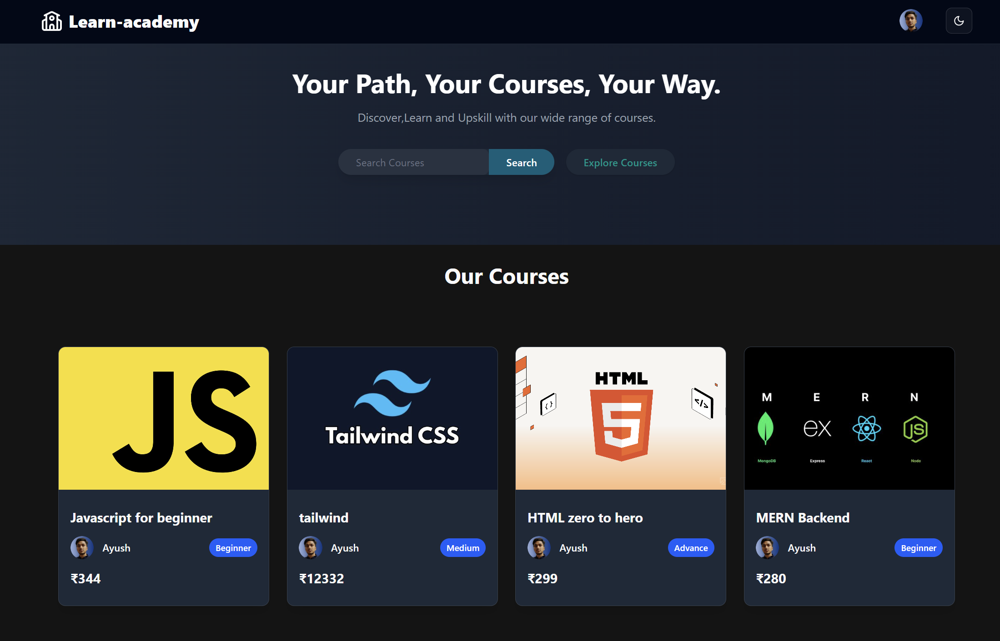
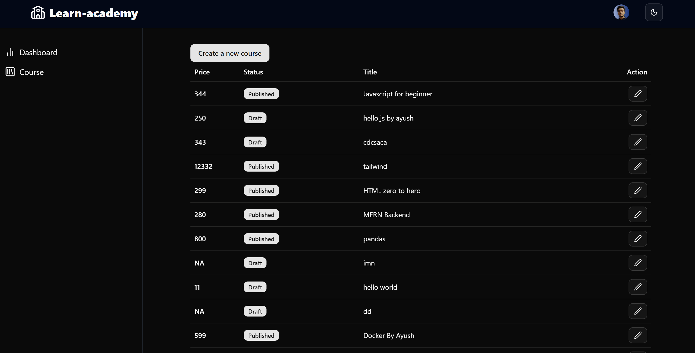
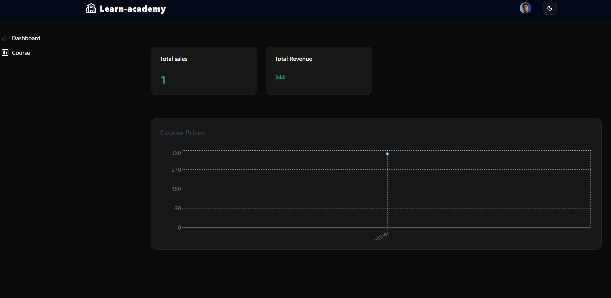

📚 Learn Academy – Advanced Learning Management System 🚀

🔗 Live Demo:
👉 https://learn-academy-learnai.vercel.app/

🚀 Overview

Learn Academy is a full-stack Learning Management System (LMS) designed to deliver a seamless, secure, and scalable online learning experience.
It supports role-based access, course monetization, progress tracking, and secure payments, making it suitable for real-world EdTech platforms.

## 📸 Screenshots

🧰 Tech Stack
🗄️ Backend

MongoDB + Mongoose

NoSQL database optimized for scalability

Schema validation & relationship handling

Node.js + Express.js

RESTful APIs

Authentication & error-handling middleware

Multer

Efficient image & video uploads

Cloud-storage ready

🎨 Frontend

React.js

Component-driven architecture

Redux Toolkit + RTK Query

Centralized state management

Efficient API caching & synchronization

Tailwind CSS + shadcn/ui

Utility-first styling

Accessible, reusable UI components

react-quill

Rich-text editor for interactive course content

Custom formatting support

💳 Payments

Stripe API

Secure payment processing

Supports one-time purchases & subscriptions

Admin-side transaction tracking

✨ Key Features
🔐 Authentication & User Management

JWT-based authentication

Secure session handling with HttpOnly cookies

Role-based access:

Admin

Instructor

Student

🎓 Course Management

Create, edit, and delete courses

Course categorization & pricing

Visibility control for published courses

🏆 Progress Tracking

Personalized student dashboards

Course completion tracking

Certificate generation on completion

💬 Engagement Tools

Instructor announcements

Student discussions

Q&A interaction system

💰 Payment & Monetization

Stripe-powered secure payments

Purchase history & invoices

Admin dashboard for sales & refunds

📂 Project Structure
Learn-Academy/
│── client/ (Frontend – React)
│   ├── components/     # Reusable UI components
│   ├── features/       # Redux slices & RTK Query APIs
│   ├── pages/          # Application views
│   ├── routes/         # Client-side routing
│   ├── utils/          # Helpers & constants
│   └── App.jsx
│
│── server/ (Backend – Node & Express)
│   ├── controllers/    # Request handling logic
│   ├── models/         # MongoDB schemas
│   ├── routes/         # REST API endpoints
│   ├── middleware/     # Auth, logging, error handling
│   └── server.js

🧪 Deployment

Frontend: Vercel

Backend: Render

Database: MongoDB Atlas

Payments: Stripe

🎯 Why Learn Academy?

Production-grade architecture

Secure authentication & payments

Scalable design for real users

Clean separation of frontend & backend

👨‍💻 Author

Ayush Singh
Full-Stack Developer | MERN Stack | AI-ML Enthusiast

“Built to solve real-world EdTech challenges with scalability and security in mind.”